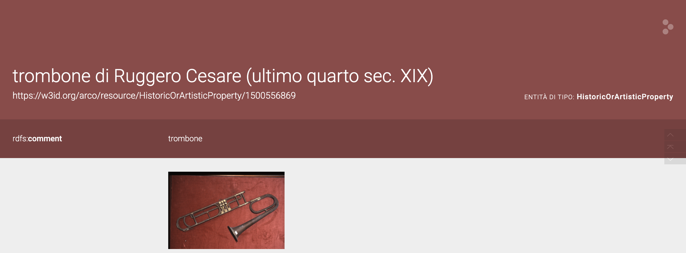
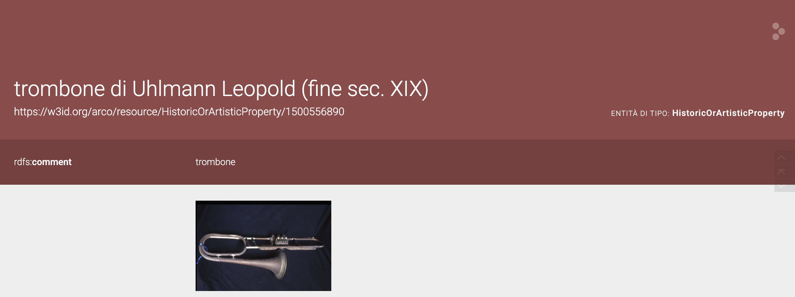

<h1 style="text-align: center;">Enriching ArCo: Knowledge Graph Enhancement through LLMs</h1>

<h1 style="text-align: center;">Exploring musical instrument and semantic gaps in Cultural Heritage data</h1>

## About the project

This project explores how SPARQL, RDF modeling, and Large Language Models (LLMs) can be combined to enrich the [ArCo Knowledge Graph](http://wit.istc.cnr.it/arco), focusing on musical instruments, particularly the trombone.

We applied a variety of prompting techniques—including zero-shot, few-shot, and chain-of-thought (CoT) prompting—to guide LLMs in producing useful, ontology-compliant triples and structured suggestions for data enrichment.

## Key objectives 

* Identify and investigate semantic gaps in ArCo’s [Music Heritage section](https://w3id.org/arco/ontology/arco/MusicHeritage)  
* Enrich instrument entries (like the trombone) with missing classifications, construction techniques, and semantic metadata   
* Employ [LLMs](https://en.wikipedia.org/wiki/Large_language_model) to support and automate RDF generation    
*	Demonstrate the value of Chain-of-Thought (CoT) prompting in complex cultural data reasoning      
*	Evaluate limitations when suggested entities are not represented in the knowledge graph   

## Technologies and techniques 

*	[SPARQL](https://dati.cultura.gov.it/sparql) + [YASGUI](https://yasgui.org/)
*	RDF 
*	Prompting with [ChatGPT](https://chatgpt.com/g/g-8i7WASBxj-home), [Gemini](https://gemini.google.com/app?hl=it), [DeepSeek](https://www.deepseek.com/en)
   * Few-shot prompting for RDF triple generation
   * Zero-shot prompting for idea discovery
   * Chain-of-Thought (CoT) prompting for structured reasoning
*	[ArCo Ontology](https://dati.beniculturali.it/lode/extract?lang=it&url=https://raw.githubusercontent.com/ICCD-MiBACT/ArCo/master/ArCo-release/ontologie/arco/arco.owl)
*	[GitHub](https://github.com/)

## Case Studies

We enriched two trombones -one by Ruggero Cesare, the other by Leopold Uhlmann- both underrepresented in the original KG structure.

* [Ruggero Cesare’s Trombone](https://dati.beniculturali.it/lodview-arco/resource/HistoricOrArtisticProperty/1500556869.html)

  

  
* [Leopold Uhlmann’s Trombone](https://dati.beniculturali.it/lodview-arco/resource/HistoricOrArtisticProperty/1500556890.html)
  
  

These instruments were enhanced with:
*	Explicit classification under musical instrument-related classes
*	Construction metadata (e.g., saldatura, rivestimento)
*	Additional semantic properties based on LLM-guided suggestions

## Teamwork and collaboration

This project was a collaborative effort carried out by all team members. We worked closely together throughout every phase of the project, from the initial brainstorming to the final data modeling and RDF validation.
We met regularly—both in person and online via Microsoft Teams—to exchange ideas, solve technical challenges, and align our strategies. Every decision was discussed as a group, and each member contributed actively to both the conceptual and practical aspects of the project.
The synergy and cooperation among us made it possible to handle a technically complex topic while keeping our workflow organized and inclusive. We are proud of the strong collaboration that shaped the outcome of this work.

## Project team

This project was created collaboratively by students of the Master’s Degree in Language, Society and Communication at the University of Bologna: Benedetta Adinolfi, Paola Cambise Ciofani, Gloria Milazzo, Gaia Milazzo, Francesca Pacini, Emma Randazzo.

