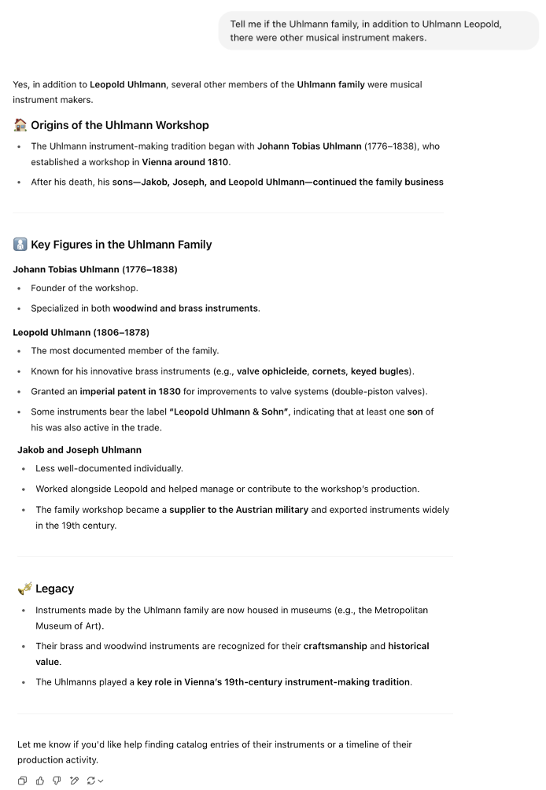

# Methodology 

Our methodological approach combines traditional SPARQL-based Knowledge Graph exploration with the generative capabilities of [Large Language Models](https://en.wikipedia.org/wiki/Large_language_model) (LLMs), aiming to identify and fill semantic and structural gaps in the [ArCo](http://wit.istc.cnr.it/arco) dataset. The process unfolds across four main phases, each targeting a specific aspect of enrichment. While each step is presented in detail in the dedicated sections, below is a brief overview of the main phases that structured our work:

1. **Gap Identification and Knowledge Graph Exploration**

We explored the ArCo Knowledge Graph to detect missing or underrepresented musical instruments, notably identifying the absence of the trombone within specific ontology classes.

1. **Triple Construction for Missing Classification**

Upon confirming the gap, we created RDF triples to formally link trombones to the appropriate classification within the knowledge graph.

1. **Triple Construction for Construction Techniques and Family Relations**

We further enriched the trombones’ descriptions by adding technical construction details and investigating the presence of related instrument makers.

1. **Triple Construction for Semantic Linking with Hornbostel-Sachs Classification**

Finally, we enhanced the semantic metadata by associating the trombones with the Hornbostel-Sachs classification system, aligning them with an internationally recognized taxonomy.

  <button onclick="showStep('step1')">Step 1</button>
  <button onclick="showStep('step2')">Step 2</button>
  <button onclick="showStep('step3')">Step 3</button>
  <button onclick="showStep('step4')">Step 4</button>

  <h2>Step 1: Gap Identification and Knowledge Graph Exploration</h2>
  

  We began our project by exploring the <a href="http://wit.istc.cnr.it/arco">ArCo</a> Knowledge Graph, focusing on the <a href="https://w3id.org/arco/ontology/arco/MusicHeritage">Music Heritage</a> section. Our goal was to identify musical instruments documented within the dataset and to investigate whether certain instruments were missing or underrepresented.

<h3>Initial query - listing musical instrument</h3>

Our first <a href="https://dati.cultura.gov.it/sparql">SPARQL</a> query aimed to retrieve all distinct musical instruments classified under the <a href="https://w3id.org/arco/ontology/arco/MusicHeritage">arco:MusicHeritage</a> class, along with their labels:

This query provided us with a general overview of the musical instruments currently categorized under the Music Heritage class.

<h3>Identifying a gap - missing instrument</h3>

We then formulated a second query to verify whether three specific instruments —trombone, trumpet (“tromba”), and violin (“violino”)— were present in the <a href="https://w3id.org/arco/ontology/arco/MusicHeritage">arco:MusicHeritage</a> class. 
The query used FILTER, REGEX, UNION, and ORDER BY clauses to search for multiple terms simultaneously:

The results showed that "tromba" and "violino" were both present, but "trombone" returned no matches, indicating a potential gap in the knowledge graph.

To confirm this absence, we executed a focused query that searched only for the term trombone in the same class:

As expected, the result table was empty, further confirming that the trombone is not represented within the MusicHeritage class:

<h3>Further investigation - other classes</h3>

We expanded our search to see if the term trombone appeared in other relevant classes. A query on the class <a href="https://w3id.org/arco/ontology/arco/MusicalInstrumentClassification">arco:MusicalInstrumentClassification</a> also returned no results:

However, when we queried the more general class <a href="https://w3id.org/arco/ontology/arco/MovableCulturalProperty">arco:MovableCulturalProperty</a>, which is a superclass of <a href="https://w3id.org/arco/ontology/arco/HistoricOrArtisticProperty">arco:HistoricOrArtisticProperty</a>, we successfully found multiple records associated with trombones:

Among the results, we selected two specific trombones as case studies for enrichment:

•	<a href="https://dati.beniculturali.it/lodview-arco/resource/HistoricOrArtisticProperty/1500556869.html">Ruggero Cesare’s trombone</a> (slide trombone / trombone a coulisse):

•	<a href="https://dati.beniculturali.it/lodview-arco/resource/HistoricOrArtisticProperty/1500556890.html">Leopold Uhlmann’s trombone</a> (slide trombone / trombone a coulisse):

 
  

  <h2>Step 2: Triple Construction for Missing Classification</h2>
  

 <h3>Gap confirmation and enrichment proposal</h3>

 <h4>• Using CONSTRUCT Sparql</h4>

We verified that these instruments —despite clearly being trombones— were not classified under <a href="https://w3id.org/arco/ontology/arco/MusicalInstrumentClassification">arco:MusicalInstrumentClassification</a>. This confirmed the presence of a semantic and structural gap in the ontology.

To address this, we proposed RDF triples to link these resources explicitly to the <a href="https://w3id.org/arco/ontology/arco/MusicalInstrumentClassification">arco:MusicalInstrumentClassification</a> class , enriching the dataset by making these associations machine-readable and formally integrated.

Using <a href="https://yasgui.org/">YASGUI</a> and the clause CONSTRUCT on SPARQL, we obtained this RDF triple to connect Cesare’s trombone to the class <a href="https://w3id.org/arco/ontology/arco/MusicalInstrumentClassification">MusicalInstrumentClassification</a>:

<h4>•	Using LLMs</h4>

After identifying the absence of the trombone within specific ArCo classes such as <a href="https://w3id.org/arco/ontology/arco/MusicalInstrumentClassification">MusicalInstrumentClassification</a>, we proceeded to create RDF triples to enrich the ArCo knowledge graph. In particular, we focused on connecting <a href="https://dati.beniculturali.it/lodview-arco/resource/HistoricOrArtisticProperty/1500556890.html">Leopold Uhlmann's trombone</a> to the missing class.

<h4>RDF Triple creation via few-shot prompting</h4>

To achieve this, we decided to rely on <a href="https://en.wikipedia.org/wiki/Large_language_model">Large Language Models</a> (LLMs) instead of manually constructing the triple. We used the few-shot prompting technique, in which two example RDF triples and SPARQL queries were provided to guide the LLMs’ response.
We used the same prompt across three different LLMs:

<ul>
  <li><a href="https://chatgpt.com/g/g-8i7WASBxj-home">ChatGPT</a></li>
  <li><a href="https://gemini.google.com/app?hl=it">Gemini</a></li>
  <li><a href="https://www.deepseek.com/en">DeepSeek</a></li>
</ul>

Prompt: 

Each LLM was asked to generate a triple linking the resource <https://w3id.org/arco/resource/HistoricOrArtisticProperty/1500556890.html> to the class <a href="https://w3id.org/arco/ontology/arco/MusicalInstrumentClassification">arco:MusicalInstrumentClassification</a>.

<ul>
<li>Gemini provided a syntactically correct RDF triple based on the examples, without further elaboration or explanation:
  
</li>
    
<li>DeepSeek produced a similar response, accurately mimicking the format of the examples:

</li>

<li>ChatGPT provided the triple along with a short explanatory comment, demonstrating understanding of the intended RDF structure:

</li>

</ul>

The responses were consistent across models, validating the effectiveness of few-shot prompting for this kind of structured output.
We used the queries suggested by these LLMs and we inserted one on <a href="https://yasgui.org/">YASGUI</a>:

In conclusion, we were able to fill the two gaps that we detected: in the first case, we filled it using the CONSTRUCT clause on SPARQL, while in the second case, we used the support of LLMs. In both cases, the RDF triples were correct.

 

  <h2>Step 3: Triple Construction for Construction Techniques and Family Relations</h2>
  

<h3>Enriching ArCo with technical construction techniques</h3>

To further enhance the knowledge graph, we investigated technical construction characteristics relevant to trombones, such as the materials or fabrication techniques involved. This step involved zero-shot prompting (asking <a href="https://chatgpt.com/g/g-8i7WASBxj-home">ChatGPT</a> directly for possible construction techniques without any example).

Based on the LLM-generated suggestions, we manually verified which of the proposed techniques were present in <a href="http://wit.istc.cnr.it/arco">ArCo</a> via SPARQL queries. 

Among the construction techniques for trombones suggested by <a href="https://chatgpt.com/g/g-8i7WASBxj-home">ChatGPT</a>, we selected two that are commonly used for any kind of trombone: welding (saldatura) and coating (rivestimento). We decided to create RDF triples to link <a href="https://dati.beniculturali.it/lodview-arco/resource/HistoricOrArtisticProperty/1500556869.html">Cesare’s trombone</a> to these two techniques.
We made the following query to search the "saldatura” entity in the denotative description "<a href="https://dati.beniculturali.it/lodview-arco/ontology/denotative-description/TechnicalCharacteristic.html">technical characteristics</a>”.

<h4>Query - "saldatura" (welding):</h4> 

This query returned several entries, among which we selected the generic "<a href="https://dati.beniculturali.it/lodview-arco/resource/TechnicalCharacteristic/saldatura.html">saldatura</a>" technique.

<h4>RDF triple for welding</h4>

We created an RDF triple to associate the "<a href="https://dati.beniculturali.it/lodview-arco/resource/TechnicalCharacteristic/saldatura.html">saldatura</a>" technique with <a href="https://dati.beniculturali.it/lodview-arco/resource/HistoricOrArtisticProperty/1500556869.html">Ruggero Cesare’s trombone</a>:

The triple ensures that "<a href="https://dati.beniculturali.it/lodview-arco/resource/TechnicalCharacteristic/saldatura.html">saldatura</a>" is now displayed under the "material or technique" section of the trombone’s ArCo entry.

We repeated the same steps for the second selected technique (coating), as follows:

<h4>Query - "rivestimento" (welding):</h4> 

From this query, we selected the generic "<a href="https://dati.beniculturali.it/lodview-arco/resource/TechnicalCharacteristic/rivestimento.html">rivestimento</a>" technique:

<h4>RDF triple for coating</h4>

We created another triple linking "<a href="https://dati.beniculturali.it/lodview-arco/resource/TechnicalCharacteristic/rivestimento.html">rivestimento</a>" to <a href="https://dati.beniculturali.it/lodview-arco/resource/HistoricOrArtisticProperty/1500556869.html">Ruggero Cesare’s trombone</a>, similarly enhancing the descriptive detail under its "material or technique" field. 

<h3>Investigating the Uhlmann Family</h3>

To further investigate the historical and cultural relevance of the Uhlmann family, we consulted external sources such as <a href="http://www.williampetit.com/16/cor-viennois-uhlmann/vienna-horn-uhlmann.htm">William Petit’s documentation</a>, which highlight the important role played by this family in the 19th-century Viennese music scene, particularly in the field of instrument manufacturing.
We aimed to verify whether other members of the Uhlmann family (besides Leopold) were represented within the ArCo knowledge graph.

<h4>Zero-Shot Prompting with LLMs</h4>

Using a zero-shot prompting approach, we asked <a href="https://chatgpt.com/g/g-8i7WASBxj-home">ChatGPT</a> if there were other musical instrument makers from the Uhlmann family. The LLM listed a few names, such as Carl Uhlmann and Johann Uhlmann, based on its general knowledge base. However, this information alone was not sufficient—we needed to validate it against the ArCo knowledge graph. 

<h4>SPARQL query for Uhlmann family members</h4>

To check for the presence of these individuals in <a href="http://wit.istc.cnr.it/arco">ArCo</a>, we designed the following query using the keyword OPTIONAL to also capture partial or incomplete records:

<h4>Results and limitations</h4>

The query returned only four instances, all of which referred to Leopold Uhlmann. No other members of the Uhlmann family appeared in the ArCo dataset. 
Consequently:

<ul>
  <li>We were unable to construct RDF triples that would relate Leopold to any additional family members</li>
  <li>Despite LLM-generated suggestions pointing to historical relevance, this information could not be validated using the available structured data in ArCo</li>
  <li>We could not enrich Leopold’s personal ArCo page with familial links, as these individuals are not represented in the knowledge graph</li>
</ul>

This represents one of the core challenges of the project: while LLMs can generate plausible and historically-informed content, their outputs require careful validation when used to enrich structured, curated knowledge graphs. Without supporting entities in the target KG, no direct enrichment is possible.

  

  <h2>Step 4: Triple Construction for Semantic Linking with Hornbostel-Sachs Classification</h2>
  

To further enhance the semantic description of the two trombones under study (those crafted by Leopold Uhlmann and Ruggero Cesare), we decided to associate them with a subclass of <a href="https://w3id.org/arco/ontology/arco/MusicalInstrumentClassification">MusicalInstrumentClassification</a>: the internationally recognized <a href="https://w3id.org/arco/ontology/arco/HornbostelSachsClassification">Hornbostel-Sachs classification</a>.

<h3>LLM support – zero-shot prompting</h3>

As a first step, we used <a href="https://chatgpt.com/g/g-8i7WASBxj-home">ChatGPT</a> with a zero-shot prompting technique to obtain information about the <a href="https://w3id.org/arco/ontology/arco/HornbostelSachsClassification">Hornbostel-Sachs classification</a>. We specified the kind of trombone (slide trombone), as we found this information during our research. The LLM provided a detailed explanation of this classification system, including its typical structure:

<h3>RDF triples: basic association with the Hornbostel-Sachs Class</h3>

We created two RDF triples to directly associate each trombone with the Hornbostel-Sachs classification class (<a href="https://w3id.org/arco/ontology/arco/HornbostelSachsClassification">arco:HornbostelSachsClassification</a>):

<ul>
  <li><a href="https://dati.beniculturali.it/lodview-arco/resource/HistoricOrArtisticProperty/1500556869.html">Cesare's trombone</a></li> &rarr; <a href="https://w3id.org/arco/ontology/arco/HornbostelSachsClassification">arco:HornbostelSachsClassification</a>

<li><a href="https://dati.beniculturali.it/lodview-arco/resource/HistoricOrArtisticProperty/1500556890.html">Uhlmann’s trombone</a></li> &rarr; <a href="https://w3id.org/arco/ontology/arco/HornbostelSachsClassification">arco:HornbostelSachsClassification</a>
</ul>

These were validated using <a href="https://yasgui.org/">YASGUI</a>, and the results showed correctly formed triples linking each instrument to the classification system. 

<a href="https://dati.beniculturali.it/lodview-arco/resource/HistoricOrArtisticProperty/1500556890.html">Uhlmann’s trombone</a>:

<a href="https://dati.beniculturali.it/lodview-arco/resource/HistoricOrArtisticProperty/1500556869.html">Cesare's trombone</a>:

<h3>Enriching with Descriptive Properties: Chain-of-Thought LLM Prompting</h3>

To go further, we asked three LLMs (<a href="https://chatgpt.com/g/g-8i7WASBxj-home">ChatGPT</a>, <a href="https://gemini.google.com/app?hl=it">Gemini</a>, <a href="https://www.deepseek.com/en">DeepSeek</a>) how we could enrich the existing connections. Using a chain-of-thought prompting strategy, we elicited detailed suggestions for further properties related to the Hornbostel-Sachs class.

We applied the same prompt on <a href="https://gemini.google.com/app?hl=it">Gemini</a> and this is the answer:

<a href="https://www.deepseek.com/en">DeepSeek</a>’s answer: 

From the three answers, ChatGPT’s suggestion was selected because:

<ul>
  <li>It aligned more closely with ArCo’s formal ontology</li>
  <li>t included properties that exist within the ArCo schema</li>
</ul>

<h3>RDF Triples: Adding Hornbostel-Sachs Metadata</h3>

Following this model, we created RDF triples that associate each trombone (Uhlmann and Cesare) with these three properties, enriching their metadata in the KG.
These triples were also tested and validated through <a href="https://yasgui.org/">YASGUI</a>, ensuring that the structure conforms to the expected ArCo ontology standards.
Uhlmann’s triple:

Cesare’s triple:

By linking both trombones to Hornbostel-Sachs classifications—first at the class level, and then at the attribute level— we added rich semantic metadata that enhances their discoverability and interoperability within ArCo and beyond.
This step showcases a best practice in cultural heritage data enrichment, combining:

<ul>
  <li>LLM-driven insight</li>
  <li>ontology-aligned RDF modeling</li>
  <li>verifiable SPARQL querying</li>
</ul>

  

<h2>Comparison of LLMs</h2>
We observed the following differences in behavior among the LLMs used:

<ul>
  <li><a href="https://chatgpt.com/g/g-8i7WASBxj-home">ChatGPT</a> consistently delivered the most context-aware and ontology-compliant results. When using chain-of-thought prompting, it was especially useful in proposing structured and detailed triples, backed by reasoning. It also provided relevant enrichment suggestions grounded in the vocabulary of ArCo.</li>
  <li><a href="https://gemini.google.com/app?hl=it">Gemini</a> (by Google) performed reliably when given clear examples (few-shot prompting), but its outputs were often syntactically correct but semantically shallow, lacking explanation or deeper contextual understanding.</li>
  <li><a href="https://www.deepseek.com/en">DeepSeek</a>, a newer open-source LLM, produced results comparable to Gemini but occasionally struggled with ontology-specific terms and sometimes returned incomplete triples or vague responses.</li>
</ul>

Ultimately, <a href="https://chatgpt.com/g/g-8i7WASBxj-home">ChatGPT</a> emerged as the most effective LLM for generating RDF triples and identifying valuable enrichment paths in the ArCo KG, particularly when using chain-of-thought and few-shot prompting. However, using multiple models provided a useful comparative perspective and reinforced the importance of prompt engineering and critical evaluation of LLM-generated content.

This project demonstrated how the combined use of SPARQL querying, knowledge graph ontology exploration, and LLM-driven knowledge generation can identify and address semantic gaps in cultural heritage datasets. It also highlighted some of the current limitations in both KGs and LLMs—especially in cases where certain real-world entities (like other members of the Uhlmann family) were not represented and could not be automatically integrated.
Our experience reinforces the potential of integrating KGs and LLMs in digital humanities, while also underlining the importance of human validation and domain expertise in curating and extending cultural knowledge representations.

<h2>Conclusion</h2>

This project aimed to explore and enrich the <a href="http://wit.istc.cnr.it/arco">ArCo Knowledge Graph</a> by identifying and addressing gaps in its representation of musical instruments, with a focus on the trombone. Using SPARQL queries, we discovered that certain culturally and historically relevant instruments—such as the trombone—were missing from specific classes like <a href="https://w3id.org/arco/ontology/arco/MusicHeritage">MusicHeritage</a> and <a href="https://w3id.org/arco/ontology/arco/MusicalInstrumentClassification">arco:MusicalInstrumentClassification</a>. 
This absence highlighted an opportunity to contribute to the semantic representation of Italian cultural heritage through Linked Open Data.
We selected two case-study instruments —the trombones of <a href="https://dati.beniculturali.it/lodview-arco/resource/HistoricOrArtisticProperty/1500556890.html">Leopold Uhlmann</a> and <a href="https://dati.beniculturali.it/lodview-arco/resource/HistoricOrArtisticProperty/1500556869.html">Ruggero Cesare</a>— and enriched their RDF descriptions by:

<ul>
  <li>Linking them to the class <a href="https://w3id.org/arco/ontology/arco/MusicalInstrumentClassification">MusicalInstrumentClassification</a>, which previously did not include them
</li>
  <li>Associating them with construction techniques such as <a href="https://dati.beniculturali.it/lodview-arco/resource/TechnicalCharacteristic/saldatura.html">saldatura</a> (welding) and <a href="https://dati.beniculturali.it/lodview-arco/resource/TechnicalCharacteristic/rivestimento.html">rivestimento</a> (coating) from the <a href="https://dati.beniculturali.it/lodview-arco/ontology/denotative-description/TechnicalCharacteristic.html">Technical Characteristics</a> class

</li>
  <li>Connecting them to the <a href="https://w3id.org/arco/ontology/arco/HornbostelSachsClassification">Hornbostel-Sachs classification</a> system and specifying three of its properties: number, definition, and edition
</li>
</ul>

To achieve these tasks, we combined structured <a href="https://dati.cultura.gov.it/sparql">SPARQL</a> querying with the use of <a href="https://en.wikipedia.org/wiki/Large_language_model">Large Language Models</a> (LLMs) to generate RDF triples and suggest semantic relationships. We applied three prompting strategies—zero-shot, few-shot, and chain-of-thought—and experimented with three different LLMs: <a href="https://chatgpt.com/g/g-8i7WASBxj-home">ChatGPT</a>, <a href="https://gemini.google.com/app?hl=it">Gemini</a>, and <a href="https://www.deepseek.com/en">DeepSeek</a>.

